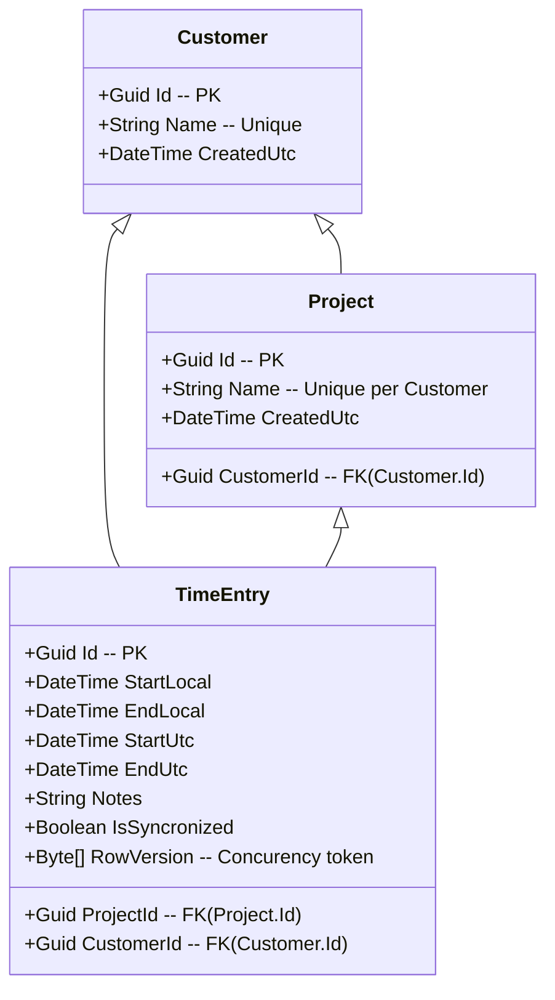

# TimeTracker — Design Document

*Last updated: Mon Sep 15 13:51:32 CEST 2025*

## 1) Problem Statement

Track billable and non‑billable work time with minimal friction across Windows/macOS/Linux. Support quarter‑hour rounding at both start and stop. Persist locally in SQLite for the desktop app; enable drop‑in backend(s) with PostgreSQL/SQLite using the same data model and EF Core migrations. Provide a lightweight localhost website to review and export data by day.

---

## 2) Goals

* **Cross‑platform desktop UI** (Avalonia) with **always‑on‑top** mini controller.
* **One‑click flow**: Select Customer + Project, type Notes, hit **Play**; **Pause** creates an entry; **Play** after Pause creates a new entry; **Stop** closes current entry.
* **Rounding**: Start and stop times round to the **nearest 15 minutes** (00, 15, 30, 45) using midpoint‑away‑from‑zero.
* **Data model parity** across SQLite/PostgreSQL.
* **Local storage in SQLite** for desktop, with provider‑specific migrations isolated per provider project.
* **Localhost web UI/API** for listing time **grouped by day**; ready for future external sync.
* **Sync‑readiness**: per‑row `ServerId`, `PendingSync`, `LastModifiedUtc`, `IsDeleted`, optimistic concurrency (`RowVersion`).
* **Deterministic time semantics**: store both Local and UTC; Local used for day grouping, UTC for sync.
* **Scriptable seeds/fixtures** for development and demos.
* **Secure authentication & authorization on the Web backend using OpenIddict** (OIDC/OAuth2) to issue/validate tokens, protect APIs, and support roles/claims and per‑user data boundaries.
* **Sign‑in for Desktop tracker and Web UI when connected to a backend**: PKCE (device code or interactive flow) for the desktop client with a local encrypted token cache; seamless fallback to offline local‑only mode when no backend is configured.

## 3) Non‑Goals (v1)

* Complex invoicing, rates, currencies, or tax handling.
* Multi‑user authentication/authorization.
* Conflict resolution UI beyond last‑write‑wins on sync.
* Mobile/tablet native apps.
* Global hotkeys when the app is not focused (can be v2, platform‑specific).
* Rich reporting (pivoting, charts). Keep it simple: daily tables + CSV export (future minor).

---

## 4) Architecture (high level)

```
TimeTracker.sln
  src/
    TimeTracker.Domain/            # POCOs only
    TimeTracker.Application/       # Services, policies (no EF/UI)
    TimeTracker.Persistence/       # EF Core DbContext (no provider packages)
    TimeTracker.Persistence.SqliteMigrations/
    TimeTracker.Persistence.PgSqlMigrations/
    TimeTracker.Desktop/           # Avalonia app (uses SQLite provider)
    TimeTracker.Web/               # Kestrel site on localhost (provider by config)
```

* **Persistence** exposes `AppDbContext` with model; provider is selected in **startup** via `UseSqlite`/`UseNpgsql` and migrations assembly pointing to the respective migrations project.
* **Desktop** embeds or starts a **Web host** on `http://127.0.0.1:5187` for listing time and basic JSON endpoints.

---

## 5) Data Model

### 5.1 Entities



### 5.2 Indexes & Uniqueness

* `Customer.Name` unique.
* `Project (CustomerId, Name)` unique.
* `TimeEntry.StartLocal` and `TimeEntry.StopLocal` indexed for fast daily ranges.

### 5.3 ER Sketch

```
Customer 1─* Project 1─* TimeEntry
```

### 5.4 Provider‑agnostic constraints

* Avoid provider‑specific functions in queries (e.g., `DateDiff*`). Compute durations in memory or with pure arithmetic after projection.

---

## 6) Time Rounding Policy

**Quarter‑hour** with midpoint‑away‑from‑zero.

* Rounding points: `:00, :15, :30, :45`.
* Examples: `12:07:29 → 12:00` ; `12:07:30 → 12:15` ; `12:52:29 → 12:45` ; `12:52:30 → 13:00`.
* **Edge handling**: If rounding causes `StopLocal <= StartLocal`, bump `Stop` by +15 minutes to avoid zero‑length rows (configurable).

---

## 7) Seed & Fixture Data

### 7.1 JSON Fixtures (can import via a tiny tool or use for tests)

```json
{
  "customers": [
    { "id": "11111111-1111-1111-1111-111111111111", "name": "Acme Corp" },
    { "id": "22222222-2222-2222-2222-222222222222", "name": "Globex" }
  ],
  "projects": [
    { "id": "aaaaaaaa-aaaa-aaaa-aaaa-aaaaaaaaaaaa", "customerId": "11111111-1111-1111-1111-111111111111", "name": "Website Revamp" },
    { "id": "bbbbbbbb-bbbb-bbbb-bbbb-bbbbbbbbbbbb", "customerId": "11111111-1111-1111-1111-111111111111", "name": "SEO Sprint" },
    { "id": "cccccccc-cccc-cccc-cccc-cccccccccccc", "customerId": "22222222-2222-2222-2222-222222222222", "name": "Internal Tools" }
  ],
  "timeEntries": [
    {
      "id": "90000000-0000-0000-0000-000000000001",
      "customerId": "11111111-1111-1111-1111-111111111111",
      "projectId": "aaaaaaaa-aaaa-aaaa-aaaa-aaaaaaaaaaaa",
      "startLocal": "2025-09-10T08:00:00",
      "stopLocal":  "2025-09-10T12:00:00",
      "startUtc":   "2025-09-10T06:00:00Z",
      "stopUtc":    "2025-09-10T10:00:00Z",
      "notes": "Initial planning",
      "pendingSync": true,
      "isDeleted": false,
      "lastModifiedUtc": "2025-09-10T10:00:00Z"
    },
    {
      "id": "90000000-0000-0000-0000-000000000002",
      "customerId": "11111111-1111-1111-1111-111111111111",
      "projectId": "bbbbbbbb-bbbb-bbbb-bbbb-bbbbbbbbbbbb",
      "startLocal": "2025-09-10T13:15:00",
      "stopLocal":  "2025-09-10T15:45:00",
      "startUtc":   "2025-09-10T11:15:00Z",
      "stopUtc":    "2025-09-10T13:45:00Z",
      "notes": "Keyword audit",
      "pendingSync": true,
      "isDeleted": false,
      "lastModifiedUtc": "2025-09-10T13:45:00Z"
    }
  ]
}
```

### 7.2 SQL Seeds (SQLite syntax; similar for Postgres)

```sql
INSERT INTO Customers (Id, Name, CreatedUtc)
VALUES ('11111111-1111-1111-1111-111111111111', 'Acme Corp', '2025-09-01T00:00:00Z'),
       ('22222222-2222-2222-2222-222222222222', 'Globex',    '2025-09-01T00:00:00Z');

INSERT INTO Projects (Id, CustomerId, Name, CreatedUtc)
VALUES ('aaaaaaaa-aaaa-aaaa-aaaa-aaaaaaaaaaaa', '11111111-1111-1111-1111-111111111111', 'Website Revamp', '2025-09-01T00:00:00Z'),
       ('bbbbbbbb-bbbb-bbbb-bbbb-bbbbbbbbbbbb', '11111111-1111-1111-1111-111111111111', 'SEO Sprint',      '2025-09-01T00:00:00Z'),
       ('cccccccc-cccc-cccc-cccc-cccccccccccc', '22222222-2222-2222-2222-222222222222', 'Internal Tools',  '2025-09-01T00:00:00Z');

INSERT INTO TimeEntries (Id, CustomerId, ProjectId, StartLocal, StopLocal, StartUtc, StopUtc, Notes, PendingSync, IsDeleted, LastModifiedUtc)
VALUES ('90000000-0000-0000-0000-000000000001','11111111-1111-1111-1111-111111111111','aaaaaaaa-aaaa-aaaa-aaaa-aaaaaaaaaaaa','2025-09-10T08:00:00','2025-09-10T12:00:00','2025-09-10T06:00:00Z','2025-09-10T10:00:00Z','Initial planning',1,0,'2025-09-10T10:00:00Z');
```

> For PostgreSQL use `TRUE/FALSE` booleans and `timestamp with time zone` for UTC fields.

### 7.3 C# Seeder Snippet (EF Core)

```csharp
public static class SeedData
{
    public static async Task EnsureSeedAsync(AppDbContext db)
    {
        await db.Database.MigrateAsync();
        if (!db.Customers.Any())
        {
            var acme = new Customer { Id = Guid.Parse("11111111-1111-1111-1111-111111111111"), Name = "Acme Corp" };
            var glob = new Customer { Id = Guid.Parse("22222222-2222-2222-2222-222222222222"), Name = "Globex" };
            var projA = new Project { Id = Guid.Parse("aaaaaaaa-aaaa-aaaa-aaaa-aaaaaaaaaaaa"), CustomerId = acme.Id, Name = "Website Revamp" };
            var projB = new Project { Id = Guid.Parse("bbbbbbbb-bbbb-bbbb-bbbb-bbbbbbbbbbbb"), CustomerId = acme.Id, Name = "SEO Sprint" };
            db.AddRange(acme, glob, projA, projB);
            await db.SaveChangesAsync();
        }
    }
}
```

---

## 8) UI/UX — Views & States

### 8.1 Desktop Main (compact controller)

**Top row**: Customer (Combo), Project (Combo)

**Middle**: Notes (single line or small multi‑line)

**Bottom**: Elapsed display + Play/Pause toggle + Stop + (checkbox) Always on top

```
┌ TimeTracker ──────────────────────────────────────────┐
│ Customer: [Acme Corp  ▾]   Project: [Website Revamp ▾]│
│ Notes:    [Fix 404 on /pricing                         ]│
│                                                     ⏱ │
│  01:23:41   [  Play/Pause  ]  [  Stop  ]   [✓] Always on top │
└───────────────────────────────────────────────────────┘
```

**States**

* **Idle**: Play enabled when both selectors picked.
* **Running**: Play shows “Pause”; Stop enabled; Elapsed updates each second; Status shows rounded start.
* **Paused/Stopped**: current entry persisted with rounded stop; next Play starts new entry.

### 8.2 Localhost Web — Daily Summary (`/`)

* Day headers with total per day (sum of rounded durations).
* Table: Start, Stop, Duration, Notes.
* Optional filter: by Customer/Project (v1.1).

```
2025‑09‑10  (Total: 06:30:00)
Start   Stop    Duration  Notes
08:00   12:00   04:00     Initial planning
13:15   15:45   02:30     Keyword audit
```

### 8.3 API Endpoints (local only for v1)

* `GET /api/time-entries` → list entries (latest first)
* `GET /api/time-entries/day/2025-09-10` → entries on that local day
* `POST /api/time-entries` → (future) add/update for scripts
* `GET /api/export.csv` → (future) CSV export

**Sample response (`GET /api/time-entries`)**

```json
[
  {
    "id": "90000000-0000-0000-0000-000000000001",
    "customerId": "11111111-1111-1111-1111-111111111111",
    "projectId": "aaaaaaaa-aaaa-aaaa-aaaa-aaaaaaaaaaaa",
    "startLocal": "2025-09-10T08:00:00",
    "stopLocal":  "2025-09-10T12:00:00",
    "durationMinutes": 240,
    "notes": "Initial planning"
  }
]
```

---

## 9) Application Services (core use cases)

### 9.1 TrackingService

* `StartAsync(customerId, projectId, notes)`

  * Round **start** to nearest 15m; create `TimeEntry` row; set `PendingSync=true`.
* `PauseAsync()`

  * Round **stop** to nearest 15m; apply zero‑length guard; persist; clear in‑memory state.
* `StopAsync()`

  * Same as `PauseAsync()` and clear.

### 9.2 Rounding Utility (shared)

```csharp
public static class QuarterHour
{
    private static readonly TimeSpan Q = TimeSpan.FromMinutes(15);
    public static DateTime RoundToNearest(DateTime dt)
    {
        var ticks = (long)Math.Round(dt.Ticks / (double)Q.Ticks, MidpointRounding.AwayFromZero);
        return new DateTime(ticks * Q.Ticks, dt.Kind);
    }
}
```

---

## 10) Persistence & Migrations

* `TimeTracker.Persistence` (no provider references).
* Startup projects select provider:

  * Desktop: `UseSqlite(..., m => m.MigrationsAssembly("TimeTracker.Persistence.SqliteMigrations"))`
  * Web (Postgres): `UseNpgsql` with their migrations assemblies.
* Each migrations project contains a design‑time factory that pins its provider for `dotnet ef` calls.

**Apply at runtime**

```csharp
using var scope = app.Services.CreateScope();
var db = scope.ServiceProvider.GetRequiredService<AppDbContext>();
await db.Database.MigrateAsync();
```

---

## 11) Example Queries

### 11.1 Group by Local Day (C# LINQ)

```csharp
var groups = db.TimeEntries
    .Where(t => !t.IsDeleted)
    .OrderByDescending(t => t.StartLocal)
    .AsEnumerable() // ensure client‑side for DateOnly conversion if needed
    .GroupBy(t => DateOnly.FromDateTime(t.StartLocal))
    .Select(g => new {
        Day = g.Key,
        Total = TimeSpan.FromMinutes(g.Sum(e => (e.StopLocal - e.StartLocal).TotalMinutes)),
        Items = g.OrderBy(e => e.StartLocal).ToList()
    })
    .ToList();
```

### 11.2 Overlapping Entries Detector (optional validation)

```csharp
bool Overlaps(TimeEntry a, TimeEntry b) => a.StartLocal < b.StopLocal && b.StartLocal < a.StopLocal;
```

---

## 12) Configuration

**Desktop (`appsettings.json`)**

```json
{
  "Database": {
    "Provider": "sqlite",
    "ConnectionString": "Data Source=${LocalAppData}/TimeTracker/worktimer.db"
  },
  "WebHost": {
    "Enabled": true,
    "Urls": ["http://127.0.0.1:5187"]
  }
}
```

**Web**

```json
{
  "Database": {
    "Provider": "postgres",
    "ConnectionStrings": {
      "postgres": "Host=localhost;Database=timetracker;Username=app;Password=secret"
    }
  }
}
```

---

## 13) Testing Strategy

* **Rounding tests**: table‑driven cases around midpoints (±1s).
* **Lifecycle tests**: Start → Pause → Start → Stop creates 2 rows with correct rounding and guards.
* **Provider smoke tests**: Apply migrations on SQLite/Postgres in CI matrix.
* **Web API tests**: `GET /api/time-entries` returns grouped/ordered projections.

---

## 14) Future Enhancements

* CSV export & basic charts (hours per customer/project by week).
* Global hotkeys per OS.
* Tagging (billable vs non‑billable) and rate tables (v2).
* External sync protocol (incremental `since` watermark) and conflict UI.
* Packaging: self‑contained publish for Linux (AppImage), Windows (.exe), macOS (.app + notarization optional).

---

## 15) Appendix — Minimal EF Model Snapshot

```csharp
modelBuilder.Entity<Customer>(b =>
{
    b.HasKey(x => x.Id);
    b.HasIndex(x => x.Name).IsUnique();
});

modelBuilder.Entity<Project>(b =>
{
    b.HasKey(x => x.Id);
    b.HasIndex(x => new { x.CustomerId, x.Name }).IsUnique();
});

modelBuilder.Entity<TimeEntry>(b =>
{
    b.HasKey(x => x.Id);
    b.HasIndex(x => x.StartLocal);
    b.HasIndex(x => x.StopLocal);
    b.Property(x => x.RowVersion).IsRowVersion();
});
```

---

**Usage**: You can copy/paste the JSON/SQL seeds to quickly populate dev databases; the view sketches map 1:1 to Avalonia controls and Razor markup. The rounding utility and queries are production‑ready.
